# Banking Platform

# Architecture Diagram

```mermaid
architecture-beta
group AWS(logos:aws)[ ]
group MS1(flat:settings)[Microservicio 1] in AWS
group MS2(flat:settings)[Microservicio 2] in AWS
group MS3(flat:settings)[Microservicio 3] in AWS
group MS4(flat:settings)[Microservicio 4] in AWS
group MS5(flat:settings)[Microservicio 5] in AWS

group amplify(logos:aws-amplify)[Pagina web Banco] in AWS
service spa(logos:react)[Single Page Application] in amplify

service rest1(logos:nodejs)[API REST 1] in MS1
service rest2(logos:python)[API REST 2] in MS2
service rest3(logos:nodejs)[API REST 3] in MS3
service rest4(logos:go)[API REST 4] in MS4
service rest5(logos:nodejs)[API REST 5] in MS5

service db1(logos:mongodb)[Database 1] in MS1
service db2(logos:postgresql)[Database 2] in MS2
service db4(logos:mysql)[Database 4] in MS4
service db5(logos:aws-athena)[Athena] in MS5

rest1:L -- R:db1
rest2:B -- T:db2
rest4:B -- T:db4
rest5:B -- T:db5

junction j1 in AWS
junction j2 in AWS
junction j3 in AWS
junction j4 in AWS
junction j5 in AWS

j1:R -- L:j2
j2:R -- L:j3
j3:R -- L:j4
j4:R -- L:j5

spa{group}:B <-- T:j3
j1:B --> T:rest1{group}
j2:B --> T:rest2{group}
j3:B --> T:rest3{group}
j4:B --> T:rest4{group}
j5:B --> T:rest5{group}

rest3{group}:L <--> R:rest2{group}
rest3{group}:R <--> L:rest4{group}
rest2{group}:L <--> R:rest1{group}

junction jb1 in AWS
junction jb2 in AWS
junction jb3 in AWS

jb1:R -- L:jb2
jb2:R -- L:jb3

junction jm1 in AWS
junction jm3 in AWS

jm1:B -- T:jb1
jm3:B -- T:jb3

rest1{group}:B <-- T:jm1
rest3{group}:B <-- T:jm3

```

---

# **Expanded Functionalities – Banking Platform**

### **MS1 – Customer Service (REST 1, MongoDB)**

Focus: **Customer onboarding, identity management, profile updates**

- **Key Functions:**

  - Customer registration (`POST /customers`) → collects personal details, identity documents.
  - Profile management (`PUT /customers/{id}`) → update contact info, preferences.
  - Retrieve customer details (`GET /customers/{id}`).
  - Link customer to their accounts (`GET /customers/{id}/accounts`) by querying MS2.

- **Business Rules:**

  - Validate uniqueness of customer (e.g., national ID, email).
  - Store flexible documents (KYC scans, address proofs) in MongoDB.
  - Trigger compliance checks in MS4 after onboarding.

---

### **MS2 – Accounts Service (REST 2, PostgreSQL)**

Focus: **Core account lifecycle management**

- **Key Functions:**

  - Account creation (`POST /accounts`) → savings, checking, credit, etc.
  - Get account details (`GET /accounts/{id}`).
  - Balance inquiry (`GET /accounts/{id}/balance`).
  - Update account status (`PUT /accounts/{id}/status`) → freeze/unfreeze/close.

- **Business Rules:**

  - Enforce one or multiple accounts per customer (linked to MS1).
  - Maintain strong consistency (ledger entries in PostgreSQL).
  - Notify MS3 when account balances are updated.

---

### **MS3 – Transactions Service (REST 3, no DB)**

Focus: **Money movement, transaction orchestration**

- **Key Functions:**

  - Initiate payment/transfer (`POST /transactions`).

    - Validate source/destination accounts with MS2.
    - Call MS4 to check compliance (fraud, AML).
    - If valid, update account balances in MS2.

  - Transaction lookup (`GET /transactions/{id}`).
  - List account transactions (`GET /accounts/{id}/transactions`).

- **Business Rules:**

  - Ensure atomicity (debit + credit must succeed or fail together).
  - Inter-service communication:

    - **With MS2** → check/update balances.
    - **With MS4** → compliance checks.

  - Maintain transaction log (could be an append-only event stream).

---

### **MS4 – Compliance & Risk Service (REST 4, MySQL)**

Focus: **KYC/AML checks, fraud prevention, regulatory rules**

- **Key Functions:**

  - Validate transaction (`POST /validateTransaction`) → check if source/destination is sanctioned, if amount exceeds threshold, if unusual behavior.
  - Risk scoring (`GET /riskScore/{customerId}`) → assign risk profiles to customers.

- **Business Rules:**

  - Store compliance rules (e.g., OFAC list, transaction limits).
  - Integrate with external fraud detection APIs.
  - Provide decision flags (approve, manual review, reject) back to MS3.
  - Maintain audit logs for regulatory reporting.

---

### **MS5 – Analytics & Reporting (REST 5, Athena)**

Focus: **Business Intelligence, regulatory reports, dashboards**

- **Key Functions:**

  - Transaction reports (`GET /reports/transactions`) → aggregate by time, customer, account type.
  - Customer analytics (`GET /reports/customers`) → new vs. active customers, churn, segmentation.
  - Ad-hoc queries (via Athena) → large-scale historical analysis.

- **Business Rules:**

  - Pull data from MS2 (accounts) and MS3 (transactions).
  - Support both regulatory compliance reports (daily/weekly) and management dashboards.
  - Enable queries over massive log/transactional datasets.

---

# **How They Interact (Example Flow)**

1. **New Customer Onboarding:**

   - SPA → MS1 (`POST /customers`) → store in MongoDB → triggers compliance check in MS4.

2. **Open Bank Account:**

   - SPA → MS2 (`POST /accounts`) with customer ID → PostgreSQL stores account info → linked to MS1.

3. **Money Transfer:**

   - SPA → MS3 (`POST /transactions`).
   - MS3 → validates accounts with MS2.
   - MS3 → calls MS4 (`POST /validateTransaction`) for compliance.
   - If approved → MS3 updates balances in MS2.

4. **Reporting:**

   - SPA → MS5 (`GET /reports/transactions`) → Athena queries aggregated transaction data.

---
