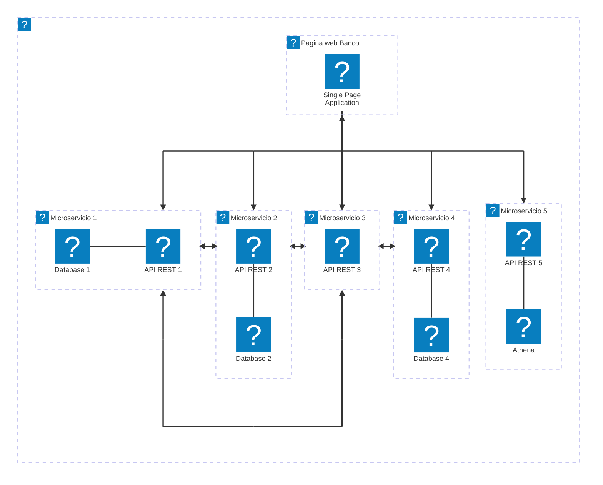

# Banking Platform

# Architecture Diagram

```mermaid
architecture-beta
group AWS(logos:aws)[ ]
group MS1(flat:settings)[Microservicio 1] in AWS
group MS2(flat:settings)[Microservicio 2] in AWS
group MS3(flat:settings)[Microservicio 3] in AWS
group MS4(flat:settings)[Microservicio 4] in AWS
group MS5(flat:settings)[Microservicio 5] in AWS

group amplify(logos:aws-amplify)[Pagina web Banco] in AWS
service spa(logos:react)[Single Page Application] in amplify

service rest1(logos:nodejs)[API REST 1] in MS1
service rest2(logos:python)[API REST 2] in MS2
service rest3(logos:nodejs)[API REST 3] in MS3
service rest4(logos:go)[API REST 4] in MS4
service rest5(logos:nodejs)[API REST 5] in MS5

service db1(logos:mongodb)[Database 1] in MS1
service db2(logos:postgresql)[Database 2] in MS2
service db4(logos:mysql)[Database 4] in MS4
service db5(logos:aws-athena)[Athena] in MS5

rest1:L -- R:db1
rest2:B -- T:db2
rest4:B -- T:db4
rest5:B -- T:db5

junction j1 in AWS
junction j2 in AWS
junction j3 in AWS
junction j4 in AWS
junction j5 in AWS

j1:R -- L:j2
j2:R -- L:j3
j3:R -- L:j4
j4:R -- L:j5

spa{group}:B <-- T:j3
j1:B --> T:rest1{group}
j2:B --> T:rest2{group}
j3:B --> T:rest3{group}
j4:B --> T:rest4{group}
j5:B --> T:rest5{group}

rest3{group}:L <--> R:rest2{group}
rest3{group}:R <--> L:rest4{group}
rest2{group}:L <--> R:rest1{group}

junction jb1 in AWS
junction jb2 in AWS
junction jb3 in AWS

jb1:R -- L:jb2
jb2:R -- L:jb3

junction jm1 in AWS
junction jm3 in AWS

jm1:B -- T:jb1
jm3:B -- T:jb3

rest1{group}:B <-- T:jm1
rest3{group}:B <-- T:jm3

```
